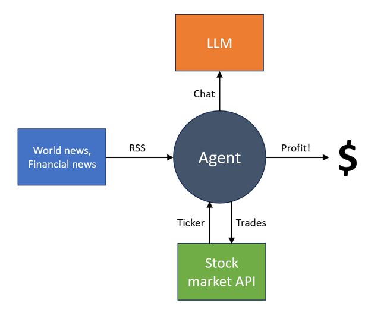
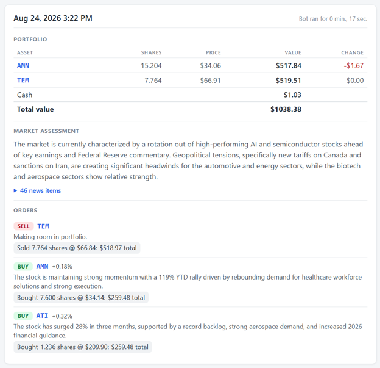
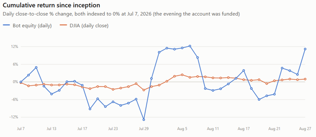

# Integrating news feeds and LLMs with Alpaca

# Introduction

I retired from professional software development last year, but still enjoy programming as much as ever. Since I don't have a salary coming in anymore, I recently started wondering if I could write some software to generate passive income instead. This quickly led to the (not very original) idea of creating an AI agent that could make money in the stock market.

I don't have much of a background in finance, but I thought that access to news about the world might give a stock-trading bot an advantage, just like it does for human traders. My hope was that financial trends based on real world news might persist for at least a few hours – long enough for a bot to leverage using consumer-grade AI. I knew this was a naive concept, but it seemed like a good starting point for a fun experiment, at least. The design in my head looked like this:



# Getting to work

I'm an F# developer, so I wanted to find .NET libraries that would provide access to the three boxes in the above diagram. I was also looking to minimize subscription and transaction costs, in the hope of creating a bot that could generate enough income to pay for itself.

A library that reads RSS feeds is available from Microsoft via System.ServiceModel.Syndication, so that part was easy. I was also familiar with LLM API's from previous projects. But how could I get data about stocks (e.g. ticker prices) and make trades from a .NET application? A few web searches led me directly to [Alpaca's C# SDK](https://www.nuget.org/packages/Alpaca.Markets/). It seemed perfect: My bot could easily get whatever ticker data it needed, and then make trades based on its conclusions, all without cost.

# News feeds

Free RSS news feeds are easy to come by, although they are all delayed by at least 15 minutes. After some investigation, I settled on these:

| Name | URL | Comment |
| :---- | :---- | :---- |
| MarketWatch<br />Top Stories | https://feeds.content.dowjones.io/public/rss/mw_topstories | Financial news (including personal finance stories that aren't relevant here) |
| CNBC<br />Top News | https://search.cnbc.com/rs/search/combinedcms/view.xml?partnerId=wrss01&id=100003114 | U.S. news |
| CNBC<br />Finance | https://search.cnbc.com/rs/search/combinedcms/view.xml?partnerId=wrss01&id=10000664 | Financial news |
| Yahoo<br />S&P 500 | https://feeds.finance.yahoo.com/rss/2.0/headline?s=%5EGSPC&region=US&lang=en-US | Financial news |

I defined an F# news feed type like this:

```fsharp
/// RSS news feed.  
type NewsFeed =  
    {  
        /// Feed name.  
        Name : string

        /// Feed URL.  
        Url : string

        /// Filters applicable to this feed.  
        Filters : seq<NewsItemFilter>  
    }

/// Filters items from a news feed.  
and NewsItemFilter = SyndicationItem -> bool
```

Fetching items from a feed then looks like:

```fsharp
/// Gets the items currently in the given feed.  
let getItemsAsync (httpClient : HttpClient) newsFeed =  
    task {  
        try  
            let! rssXml = httpClient.GetStringAsync(newsFeed.Url)  
            use stringReader = new StringReader(rssXml)  
            use xmlReader = XmlReader.Create(stringReader)  
            let feed = SyndicationFeed.Load(xmlReader)  
            return Ok [|  
                for item in feed.Items do  
                    let keep =  
                        Seq.forall (fun filter ->  
                            filter item) newsFeed.Filters  
                    if keep then  
                        NewsItem.create  
                            item.Id  
                            item.PublishDate  
                            item.Title.Text  
                            item.Summary.Text  
            |]  
        with exn ->  
            let error =  
                NewsFeedError.create  
                    newsFeed.Name exn.Message  
            return Error error  
    } |> Async.AwaitTask
```

This is an asynchronous function that returns an error value if something goes wrong, rather than throwing an exception. Representing failures like this forces the caller to handle the error explicitly, which means the program won't crash due to an unhandled exception.

A typical news item is:

```json
{  
  Id = "108353087"  
  PublishDate = 8/24/2026 8:21:17 AM +00:00  
  Title =  
     "Alibaba plunges after announcing $10.2 billion share placement to  
      fund AI push"  
  Summary =  
     "Alibaba shares plunged 10% after the tech giant priced a $10.2  
      billion share placement to fund its growing AI investments."  
}
```

Note that this contains only a summary of the actual news article, rather than its full content. I assumed optimistically that this is still rich enough to provide an actionable signal in many cases.

# Market assessment

The next step was to feed these news items into an LLM and have it identify stocks of interest. The prompt I settled on is:

> As a savvy stock trader, scan the news items below for robust trends that are likely to persist over a period of hours or days. Assess the overall state of the market and then identify the specific US companies that are likely to trend positive or negative in the market and explain why. Return ONLY ticker symbols (not company names) for liquid US equities.

Note that this assumes that the LLM cam map a company's name to its stock symbol without assistance. In practice, this seems to be true, except for occasional outliers (e.g. companies that have recently changed their symbol).

I used a JSON schema to shape the response into a collection of assets that the LLM thinks are trending either positive or negative:

```fsharp
/// Assessment of the market.  
type MarketAssessment =  
    {  
        /// Overall market state.  
        State : string

        /// Asset assessments.  
        AssetAssessments : AssetAssessment[]  
    }

/// Asset assessment.  
and AssetAssessment =  
    {  
        /// Asset in question.  
        Asset : Asset

        /// Predicted asset trend.  
        Trend : Trend

        /// Reason behind this assessment.  
        Reason : string  
    }

/// Asset symbol. E.g. Apple = "AAPL".  
and Asset = string

/// Asset trend.  
and Trend =  
    | Positive = 0  
    | Negative = 1
```

Note that this records the LLM's prediction of each stock's trend going forward, which may be very different from the stock's actual trend up to this point.

A typical market assessment might look like this:

```json
{  
  State =  
   "The US market is currently exhibiting a divergence where the Dow  
    Jones is rising while the Nasdaq and S&P 500 are being dragged down  
    by a significant correction in semiconductor and technology stocks."  
  AssetAssessments = [|  
    {  
       Asset = STLD  
       Trend = Positive  
       Reason =  
        "Benefiting from President Trump's threat of 50% tariffs on  
         Canadian auto imports, which is expected to boost domestic  
         steel demand."  
    }  
    {  
       Asset = NUE  
       Trend = Positive  
       Reason =  
        "Gaining momentum as trade tensions with Canada escalate,  
         Positioning domestic steel producers as primary beneficiaries  
         of new tariff policies."  
    }  
    {  
       Asset = NVDA  
       Trend = Negative  
       Reason =  
        "Currently trending negative as the stock dives alongside other  
         tech giants ahead of its upcoming earnings release."  
    }  
  |]  
}
```

# Making trades

With a market assessment in hand, the agent could then use data from Alpaca to decide which stocks to buy and sell. I designed a simple algorithm:

* Group predicted positive-trending stocks together into a "might buy" group and predicted negative-trending stocks together into a "might sell" group.  
* From the might-buy group, eliminate stocks that have not increased in price by at least 0.1% in the last hour. This ensures that the actual trend aligns with the predicted trend, at least to some extent, before pulling the trigger on a purchase. (Note that ticker data is delayed by 15 minutes on Alpaca's free tier.)  
* For each asset in the bot's current portfolio:  
  * If it is in the might-sell group, sell it  
  * Else if it is in the might-buy group, keep it  
  * Else if there are are any stocks in the might-buy group, sell it to generate cash  
* Use any cash now in the portfolio to buy equal quantities of each stock in the might-buy group (if any).

This algorithm is implemented in the a function that returns an array of sell order results and an array of buy order results:

```fsharp
/// Places orders based on the given assessment.  
let placeOrders broker portfolio assessment =  
    …   // implementation omitted for brevity
```

One entertaining, but possibly unwise, characteristic of this algorithm is that it churns assets frequently. It usually sells the bot's entire portfolio any time it wants to buy anything. While this is certainly not a conventional strategy, it's consistent with the idea of exploiting short-term trends that last only a few hours.

## Alpaca broker

In order to support this algorithm, I created an Alpaca API type:

```fsharp
open Alpaca.Markets

/// Alpaca API.  
type Api =  
    {  
        /// Data client. (E.g. price history.)  
        DataClient : IAlpacaDataClient

        /// Trading client. (E.g. buy/sell assets.)  
        TradingClient : IAlpacaTradingClient  
    }
```

And defined five fundamental functions that use this API to act as a "broker" for buying and selling stocks:

* **getPortfolio**: Gets the current portfolio.  
* **isMarketOpen**: Indicates whether the market is currently open.  
* **getPriceChange**: Gets recent percentage change in a given asset's price.  
* **sell**: Sells a given quantity of a given asset.  
* **buy**: Buys a given asset with the given money.

The functions share a common pattern of taking an Api instance as input and returning an F# `Async<Result<'T, string>>` type that contains either the desired data (of type 'T) or an error message if something went wrong. Again, this error handling pattern prevents an exception from bringing down the entire program. For example, here is the implementation of isMarketOpen:

```fsharp
/// Is the market currently open?  
let isMarketOpen api =  
    task {  
        try  
            let! clock = api.TradingClient.GetClockAsync()  
            return Ok clock.IsOpen  
        with exn ->  
            return Error exn.Message  
    } |> Async.AwaitTask
```

In order to buy and sell stocks, I created a helper function for placing a market order:

```fsharp
/// Places the given order.  
let placeOrder api (order : MarketOrder) =  
    task {  
        try  
            let! posted =  
                api.TradingClient.PostOrderAsync(order)  
            match! awaitOrder api posted.OrderId with  
                | Ok detail ->  
                    return Ok detail  
                | Error (Some status) ->  
                    return Error $"Order status: {string status}"  
                | Error None ->  
                    return Error "Order still in progress"  
        with exn ->  
            return Error exn.Message  
    } |> Async.AwaitTask
```

This uses another helper function (not shown) called awaitOrder that waits up to several seconds for a posted order to succeed or fail. Selling an asset is then simply a matter of creating and placing an Alpaca sell order:

```fsharp
/// Sells the given quantity of the given asset.  
let sell api asset quantity =  
    async {  
        let order =  
            MarketOrder.Sell(  
                asset.Symbol,  
                OrderQuantity.Fractional(quantity))  
        return! placeOrder api order  
    }
```

And buying an asset is similarly a matter of creating and placing a buy order:

```fsharp
type Money = Usd of decimal   // U.S. dollars ($)

/// Buys the given asset with the given money.  
let buy api asset (Usd usd) =  
    async {  
        let usd = truncate (usd * 100m) / 100m   // limit to 2 places  
        let order =  
            MarketOrder.Buy(  
                asset.Symbol,  
                OrderQuantity.Notional(usd))  
        return! placeOrder api order  
    }
```

One interesting tidbit I learned while debugging this function is that Alpaca doesn't let you spend fractions of a cent, so I had to truncate the money spent to two decimal places. These sort of "business rules" are usually easy to bake into the broker implementation where needed.

# Running the bot

With this machinery in place, we can now run one complete cycle of the bot, which follows a simple recipe (error handling omitted):

* Get the current portfolio  
* If the market is open then  
  * Get a market assessment from the LLM by sending it the latest news items  
  * Buy and sell specific stocks based on the market assessment

The corresponding function has the following signature:

```fsharp
/// Result of a single run.  
type RunResult =  
    {  
        /// Start of run.  
        StartTime : DateTimeOffset

        /// Indicates whether the market is open.  
        IsMarketOpen : bool

        /// Portfolio at start of run.  
        PortfolioResult : Result<Portfolio, string (*message*)>

        /// Market assessment.  
        MarketAssessmentResultOpt : Option<MarketAssessmentResult>

        /// Sell results.  
        SellResults : OrderResult[]

        /// Buy results.  
        BuyResults : OrderResult[]

        /// End of run.  
        EndTime : DateTimeOffset  
    }

/// Runs once using the given context.  
let runOne context : Async<RunResult> =  
    …   // implementation omitted for brevity
```

We actually want the bot to run indefinitely every N minutes, which we can do with an F# asyncSeq:

```fsharp
/// Runs in an infinite loop using the given context.  
let runLoop context delay : AsyncSeq<RunResult> =  
    asyncSeq {  
        while true do  
            let! result = runOne context  
            yield result  
            do! Async.Sleep(delay : TimeSpan)  
    }
```

# Stock trading web site

Sticking with the F# theme, I wanted to run the bot on a [Suave](https://suave.io/) web server using [Fable remoting](https://zaid-ajaj.github.io/Fable.Remoting/). The server component hosting the bot exposes a simple API that returns all the results accumulated so far:

```fsharp
type IStockTradingBotApi =  
    {  
        GetResults : unit -> Async<RunResult[]>  
    }
```

This makes it easy to consume the stock trading API from an F# [Fable](https://fable.io/) client using a pure functional "[Elmish](https://elmish.github.io/elmish/)" architecture. The client just has to render the run results in a readable way, but since I'm more of a back-end developer (and allergic to CSS in particular), I decided to let Claude Code write the front end for me. [Feliz](https://fable-hub.github.io/Feliz/) provides React-based DSL to declare HTML elements needed at runtime. For example, rendering a RunResult is done as follows:

```fsharp
open Feliz

/// Renders a single run as a card.  
let renderRun (runResult : RunResult) =  
    Html.div [  
        prop.className "run-card"  
        prop.children [  
            Html.div [  
                prop.className "run-header"  
                prop.children [  
                    Html.span [  
                        prop.className "run-time"  
                        prop.text (formatTimestamp runResult.EndTime)  
                    ]  
                    Html.span [  
                        prop.className "run-duration"  
                        prop.text  
                            (formatDuration  
                                runResult.StartTime runResult.EndTime)  
                    ]  
                ]  
            ]

                // portfolio is always fetched  
            renderPortfolio runResult.PortfolioResult

                // is the market open?  
            if runResult.IsMarketOpen then  
                match runResult.MarketAssessmentResultOpt with  
                    | Some assessmentResult ->  
                        renderMarketAssessment assessmentResult  
                    | None -> Html.none  
                renderOrders runResult.SellResults runResult.BuyResults  
            else  
                Html.div [  
                    prop.className "closed"  
                    prop.text "Market is closed"  
                ]  
        ]  
    ]
```

The resulting web page looks like this:



All the source code is available on [GitHub](https://github.com/brianberns/PassiveIncome/tree/main/StockTradingBot) and you can see how the bot is doing for yourself on my website here: [https://www.bernsrite.com/StockTradingBot/](https://www.bernsrite.com/StockTradingBot/)

# Results so far

As of this writing, the stock trading bot is up about 10% since it started running with $1000 in paper money last month (vs +1.0% for the Dow Jones over the same period):



However, the value of the portfolio has see-sawed quite a bit over that time, rather than exhibiting a steady trend, which is probably to be expected given the agent's tendency to churn. Since all of the transactions go through the Alpaca API, I'm able to use my Alpaca dashboard to analyze every trade. However, the bot's web site is the only place where the *reasoning* behind those transactions is currently kept.

I consider the project a success so far, because it has demonstrated the viability of integrating news feeds with stock purchases via generative AI and shown occasional hints of competence. However, I probably wouldn't trust it with any real money quite yet – beating the market over the long run is notoriously difficult, even for human experts with access to real-time data. If I were to push forward with the idea, here are the areas I would focus on improving next:

* Send the full content of news items to the LLM, rather than just the headlines and summaries.  
* Send historical "bars" from Alpaca to the LLM for stocks of interest to the LLM. Right now, the LLM has no insight into how the assets have performed over time, and is simply reacting to news feeds alone.  
* Reduce churn by holding onto stocks that are performing well, even if they are no longer in the news.
